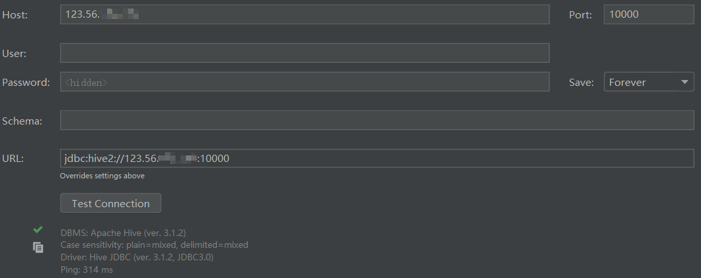
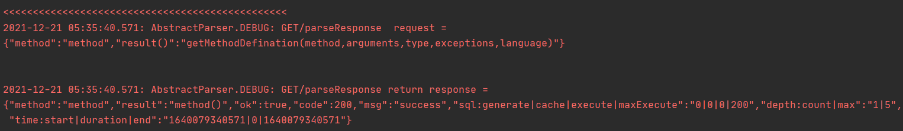
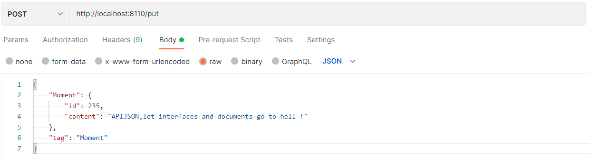
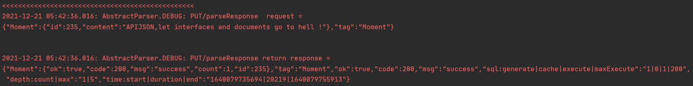
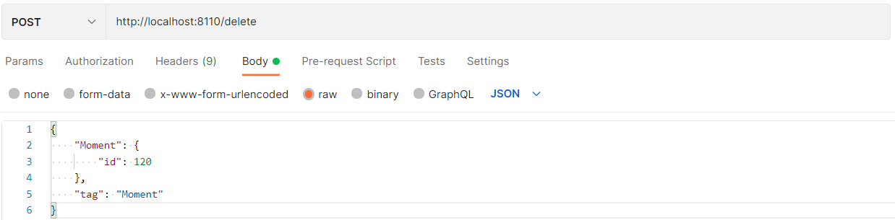
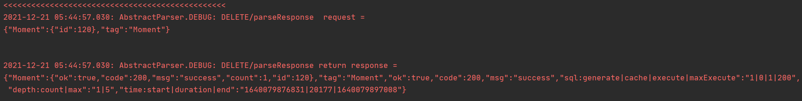
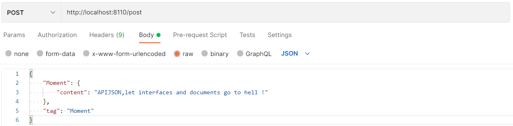
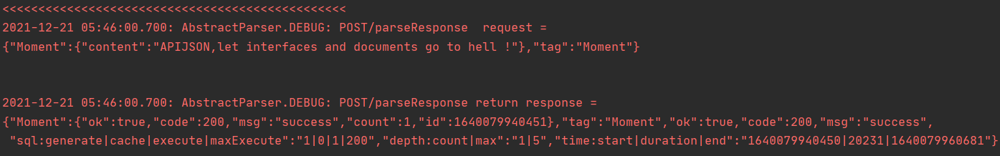
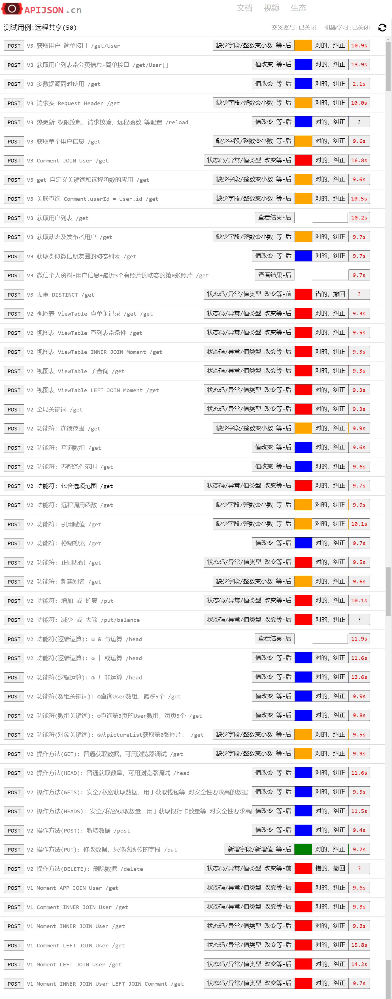

# APIJSONBoot_Hive

APIJSON + SpringBoot连接Hive使用的Demo

## 安装&使用
>JDK： 1.8+
>
>Maven： 3.0+
>
>数据库：Hive 3.1.2 Hadoop 3.1.3
>
>JDBC 驱动: 
>
>```
><groupId>org.apache.hive</groupId>
><artifactId>hive-jdbc</artifactId>
><version>3.1.2</version>
>```
### 1.导入项目

IntelliJ IDEA导入：

顶部菜单File > Open > Browse

### 2.导入表文件到数据库，修改数据库配置

后端需要Hive，安装之后可以使用hive.sql脚本建表和导入数据。
[安装参考官方文档](https://cwiki.apache.org/confluence/display/Hive/Home)

修改DemoSQLConfig源码，配置自己的数据库

#### 需要配置Hive支持事务



        <property>
                <name>hive.support.concurrency</name>
                <value>true</value>
        </property>
        <property>
                <name>hive.exec.dynamic.partition.mode</name>
                <value>nonstrict</value>
        </property>
        <property>
                <name>hive.txn.manager</name>
                <value>org.apache.hadoop.hive.ql.lockmgr.DbTxnManager</value>
        </property>

### 运行

右键 DemoApplication > Run As > Java Application

SpringBoot默认端口8110

### 测试

完成查询，删除，修改，增加测试

#### 通过启动校验



#### 请求













### APIAUTO回归测试


